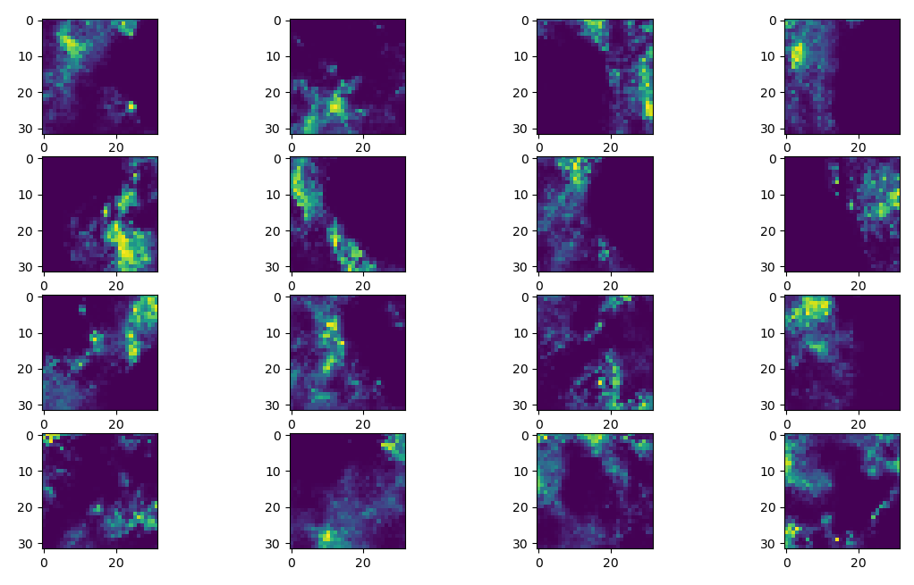

# RainMapGenerator
This is an implementation of RainGAN: A rain filed generator. 

## Abstract 
Rain fields’ simulation is an important tool for several research fields and applications. However, most simulations are based on a naive model that cannot capture complex spatial distribution. In this work, we present RainGAN, a generative model that enables a generation of a realistic, complex rain field that is conditioned on user parameters such as max peak, number of peaks, etc.  In addition, we construct a dataset of typical rain fields that are based on radar measurement and have been utilized in the training process. We conducted several experiments and demonstrate the generator quality using both numerical and visual results.

## Using RainGAN
Before using this code pleae install the requirements file.
```
pip install requirements.txt
```
Here is an example of rain field generation using RainGAN.
Beforehand, please install the requirements file. This code generate a rain filed with the following parameters:
1. rain_coverage=0.3 (Control the percentage of rainy pixels in the output rain filed)
2. n_peaks=5  (Control the number of peaks filed)
2. peak_rain_rate=1  (Control peak rain value)
 ```
h,w=32,32
rain_field_function = get_rain_gan_function(h, w)
k = 4
sample = rain_field_function(rain_coverage=0.3, 
                             n_peaks=5,
                             peak_rain_rate=1, 
                             batch_size=k ** 2)
for i in range(k):
    for j in range(k):
        plt.subplot(k, k, i + 1 + 4 * j)
        plt.imshow(sample[i + 4 * j, :, :])
plt.show()
```
Here is the results output 


## Training
### Build Dataset Pickle
The RainGAN training require a dataset of  Rain Image. In this project our dataset is base on SHMI radar map, to construction of such a dataset requires two steps.
 
1.Download Radar Map: This is 
```
python scripts/download_radar_images.py 
```
Generate Dataset Pickle
```
python scripts/download_radar_images.py 
```

### Training

```
python scripts/download_radar_images.py 
```


## Issues

## Reference


